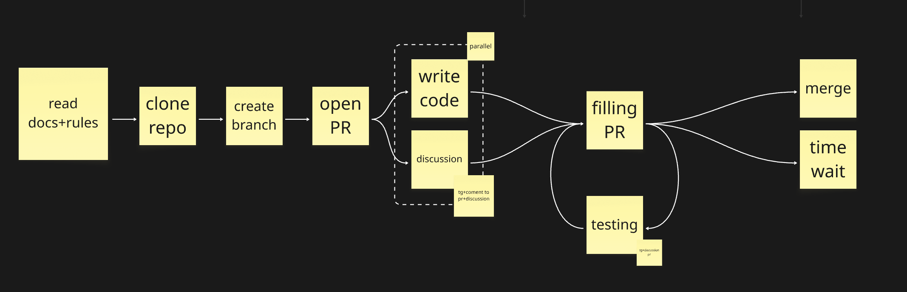
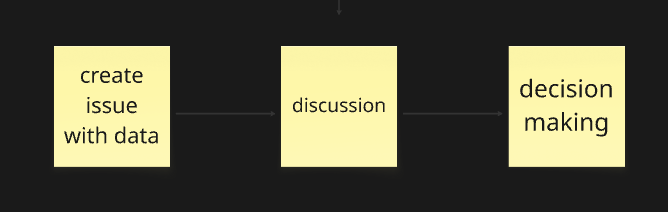
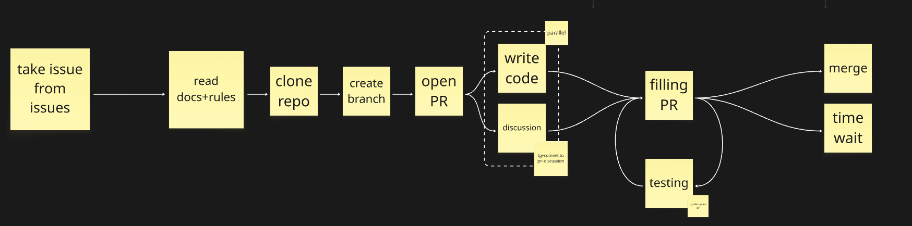

# Introduction

**In this project, we follow the principle of "Code over Conversations" and recommend that all newcomers adhere to this approach as well.**

We believe that the best discussions arise around working code, not abstract ideas. Here you don't need to ask for permission or go through quests to create tasks. Just start — and your Pull Request will become the best beginning for discussion.

## Now let's break it down point by point...



### **Have an idea and want to implement something?**

```
Your path will look like this:
1. Clone the repository to your local machine
2. Create and switch to your branch
3. Sync and create a PR with [WIP] prefix
4. In the description, write what and why you're doing it
5. Make your changes
6. Push to your remote branch
7. Update the PR
```

______________________________________________________________________



### **Have an idea you just want to share?**

```
Your path will look like this:
1. Go to the "Issues" tab
2. Create an issue and start the discussion
3. Communicate your idea with the community
```

______________________________________________________________________



### **Or just want to build something manually...**

```
Your path will look like this:
1. Go to the "Issues" tab
2. Choose a task that interests you
3. Clone the repository
4. Create your branch
5. Switch to it
6. Sync and create a PR with [WIP] prefix
7. In the description, write what and why you're doing it
8. Make your changes
9. Push to your remote branch
10. Update the PR
```

______________________________________________________________________

### Review process for any code you want to merge

```
- Maintainers and community will provide feedback in comments
- Make changes and push to the same branch — PR will update
- When everything is ready, remove [WIP] from the title
- After approval and passing tests, the PR will be merged
```

______________________________________________________________________

### Code requirements

```
- Code follows project style // we use PEP8
- Tests added (if applicable)
- Documentation updated
- All tests pass
- Description clearly explains the changes
```

______________________________________________________________________

### Project protection

```
- `main` branch is protected — only maintainers can merge
- All changes go through code review and automatic checks
- Branches are automatically deleted after PR merge
```

______________________________________________________________________

### Communication

```
All communication takes place in several places:
- "Issues" tab + relevant topic
- PR + relevant request
- TG group @sgr-community
```
