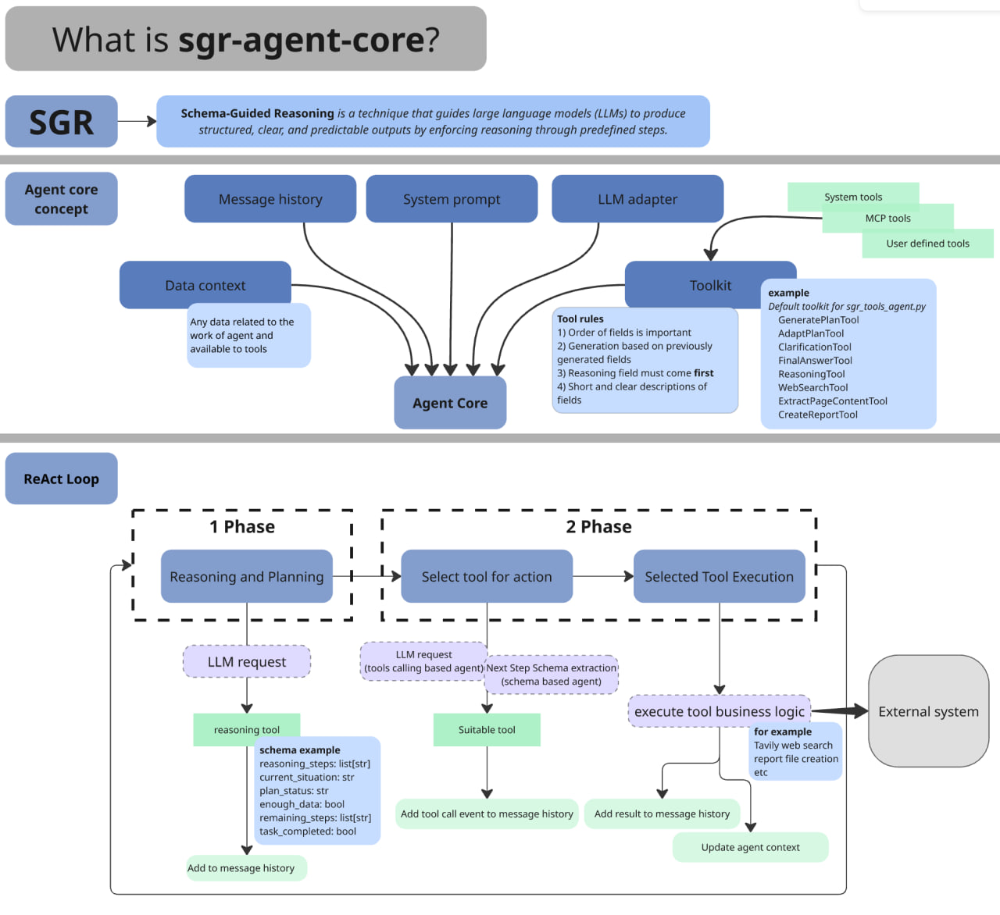

# SGR Agent Core — the first SGR open-source agentic framework for Schema-Guided Reasoning

## Description

Open-source agentic framework for building intelligent research agents using Schema-Guided Reasoning. The project provides a core library with a extendable BaseAgent interface implementing a two-phase architecture and multiple ready-to-use research agent implementations built on top of it.

The library includes extensible tools for search, reasoning, and clarification, real-time streaming responses, OpenAI-compatible REST API. Works with any OpenAI-compatible LLM, including local models for fully private research.

______________________________________________________________________

## Documentation

> **Get started quickly with our documentation:**

- **[Project Wiki](https://github.com/vamplabAI/sgr-deep-research/wiki)** - Complete project documentation
- **[Quick Start Guide](https://github.com/vamplabAI/sgr-deep-research/wiki/SGR-Quick-Start)** - Get up and running in minutes
- **[API Documentation](https://github.com/vamplabAI/sgr-deep-research/wiki/SGR-Description-API)** - REST API reference with examples

______________________________________________________________________

## Benchmarking

**Performance Metrics on gpt-4.1-mini:**

- **Accuracy:** 86.08%
- **Correct:** 3,724 answers
- **Incorrect:** 554 answers
- **Not Attempted:** 48 answers

More detailed benchmark results are available [here](benchmark/simpleqa_benchmark_results.md).

______________________________________________________________________

## Open-Source Development Team

*All development is driven by pure enthusiasm and open-source community collaboration. We welcome contributors of all skill levels!*

- **SGR Concept Creator** // [@abdullin](https://t.me/llm_under_hood)
- **Project Coordinator & Vision** // [@VaKovaLskii](https://t.me/neuraldeep)
- **Lead Core Developer** // [@virrius](https://t.me/virrius_tech)
- **API Development** // [Pavel Zloi](https://t.me/evilfreelancer)
- **Hybrid FC research** // [@Shadekss](https://t.me/Shadekss)
- **DevOps & Deployment** // [@mixaill76](https://t.me/mixaill76)

If you have any questions - feel free to reach out to [Valerii Kovalskii](https://www.linkedin.com/in/vakovalskii/)↗️.

## Special Thanks To:

This project is developed by the **neuraldeep** community. It is inspired by the Schema-Guided Reasoning (SGR) work and [SGR Agent Demo](https://abdullin.com/schema-guided-reasoning/demo)↗️ delivered by "LLM Under the Hood" community and AI R&D Hub of [TIMETOACT GROUP Österreich](https://www.timetoact-group.at)↗️

Recent benchmarks and validation experiments were conducted in collaboration with the AI R&D team at red_mad_robot. The lab operates at the intersection of fundamental science and real-world business challenges, running applied experiments and building scalable AI solutions with measurable value.

Learn more about the company: [redmadrobot.ai](https://redmadrobot.ai/) ↗️

## Star History

