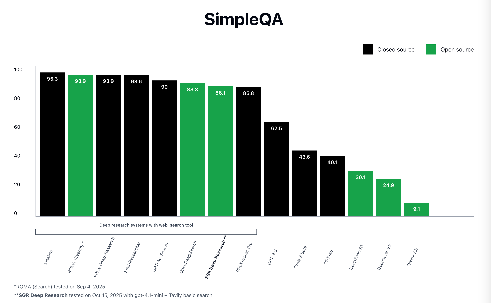

# Problem Statement

The objective of this research was to test the SGR Agent Core system and compare it with analogues.

# Methodology

The first step was to find a benchmark. During the search, it was decided to use SimpleQA as the benchmark. This is an open dataset from OpenAI designed to evaluate the factual accuracy of LLMs. It consists of 4326 questions and answers covering various topics: science, politics, sports, and others.
The dataset for this benchmark was taken from Hugging Face from here (https://huggingface.co/datasets/basicv8vc/SimpleQA).
For comparison with other search tools, the leaderboard from the ROMA repository was used (https://github.com/sentient-agi/ROMA).

The next step was the implementation of the testing logic. We isolated the `sgr_tool_calling_agent` and limited it to the following tools:

- ReasoningTool;
- WebSearchTool;
- ExtractPageContentTool;
- FinalAnswerTool.

System configuration during the benchmark run:

## Agent Configuration and Benchmark Run

| Component         | Parameter        | Value                  |
| ----------------- | ---------------- | ---------------------- |
| **Search Engine** | Provider         | Tavily Basic Search    |
|                   | Scraping Enabled | Yes                    |
|                   | Max Pages        | 5                      |
|                   | Content Limit    | 33,000 characters      |
| **Agent**         | Name             | sgr_tool_calling_agent |
|                   | Max Steps        | 20                     |
| **LLM (Agent)**   | Model            | gpt-4.1-mini           |
|                   | Max Tokens       | 12,000                 |
|                   | Temperature      | 0.2                    |
| **LLM (Judge)**   | Model            | gpt-4o                 |
|                   | Max Tokens       | Default                |
|                   | Temperature      | Default                |

Last version project exist on commit - 06a418bbb63728fe56bda27894ec263be4ceab81.

### How to Run

1. **Setup environment and dependencies:**

   ```bash
   cd benchmark
   pip install -r requirements.txt
   cp env.example .env # fill env
   ```

2. **Run benchmark:**

   ```bash
   python run_simpleqa_benchmark.py \
       --path_to_simpleqa ./data/simpleqa_verified.csv \
       --output_path ./simpleqa_bench_results.xlsx \
       --batch_size 10
   ```

# Results



As a result, our agent achieved an Accuracy = 0.861

## Benchmark Metrics

| Metric            | Value       |
| ----------------- | ----------- |
| Tokens            | 232 million |
| /search requests  | 8k          |
| /extract requests | 1,200       |
| Total cost        | $170        |

# Conclusions

Our result shows that ***even small LLMs***, using the Schema-Guided Reasoning approach, can achieve quality comparable to LLMs on popular search tools.
